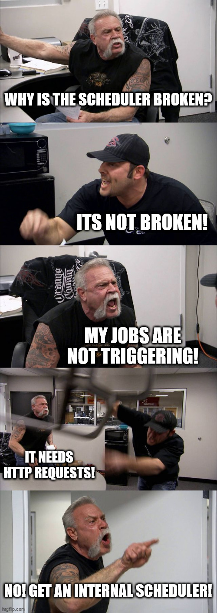

Rolled your own parse-server, and realized scheduled jobs don't work out of the box?

## Usage 

in your `cloud/index.js` or `app.js` simply include:

```
require('parse-server-scheduler')(Parse)
```

> Voila! Profit! 

## Why



Parse exposes scheduled jobs as HTTP endpoints, which is great and a disappointment at the same time :)<br><br>
This empowers your server with an internal scheduler using the `cron` and `moment` npm-packages.

